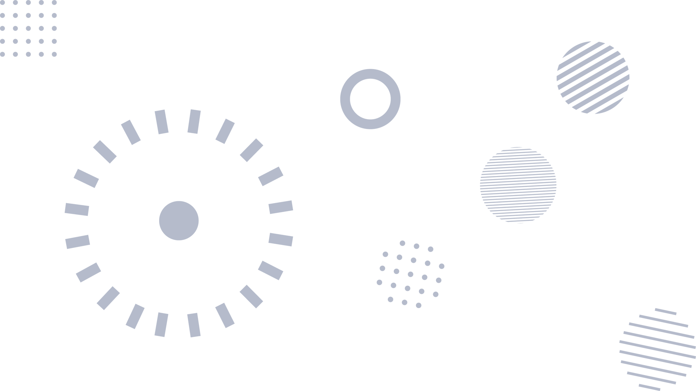

# SEOCOM — SEO Consulting HTML Template

> **Rank Higher. Grow Faster.**

A premium, framework-free HTML template built for SEO consulting firms. Pure HTML, CSS, and vanilla JavaScript — no dependencies, no build tools, just clean code that loads fast and ranks well.



---

## Live Demo

[**View Live Site**](https://tally.so/r/q4q1L9)

---

## Features

- **4 Pages** — Home, About, Services, Contact
- **Fully Responsive** — Mobile-first design that works on every screen
- **No Frameworks** — Pure HTML/CSS/vanilla JS, zero dependencies
- **Fast Loading** — Optimized assets, minimal HTTP requests
- **SEO-Ready** — Semantic HTML, meta tags, clean markup
- **Dark Theme Support** — Built-in dark sections and footer
- **Scroll Animations** — Subtle reveal effects with Intersection Observer
- **Interactive Elements** — FAQ accordion, counter animations, mobile menu
- **Contact Form** — Working form with validation and success feedback

---

## Pages

| Page | Description |
|------|-------------|
| `index.html` | Hero with stats, services grid, about preview, case studies, testimonials, CTA |
| `about.html` | Company story, stats bar, values, team section |
| `services.html` | Detailed service breakdowns, 4-step process, FAQ accordion |
| `contact.html` | Contact form, office info, working hours |

---

## Project Structure

```
seo-consulting-html-template/
├── index.html          # Homepage
├── about.html          # About page
├── services.html       # Services page
├── contact.html        # Contact page
├── style.css           # All styles (CSS custom properties)
├── main.js             # Vanilla JS (no dependencies)
├── README.md           # This file
└── assets/
    └── img/            # All images
        ├── hero-header-bg.png
        ├── hero-header.png
        ├── about.png
        ├── project-1.jpg
        ├── project-2.jpg
        ├── project-3.jpg
        ├── project-4.jpg
        ├── project-5.jpg
        └── project-6.jpg
```

---

## Brand Identity

- **Brand:** SEOCOM
- **Tagline:** Rank Higher. Grow Faster.
- **Colors:** Teal `#0D9488` + Dark `#111827`
- **Font:** Inter (Google Fonts)
- **Industry:** SEO Consulting

---

## Customization

### Colors

Edit the CSS custom properties at the top of `style.css`:

```css
:root {
  --teal: #0D9488;
  --teal-light: #14b8a6;
  --teal-dark: #0f766e;
  --dark: #111827;
  --dark-light: #1f2937;
}
```

### Fonts

Change the Google Fonts link in each HTML file's `<head>` and update `font-family` in `style.css`.

### Images

Replace images in `assets/img/`. Recommended sizes:
- Hero background: 1920x1080px
- Project cards: 800x600px
- About image: 800x600px

---

## Getting Started

1. Download or clone the template
2. Open `index.html` in your browser
3. Edit content, colors, and images to match your brand
4. Deploy to your hosting provider

No build step required. Just open and edit.

---

## Browser Support

- Chrome (latest)
- Firefox (latest)
- Safari (latest)
- Edge (latest)
- Mobile browsers (iOS Safari, Chrome for Android)

---

## Credits

- **Font:** [Inter](https://fonts.google.com/specimen/Inter) by Rasmus Andersson
- **Images:** Original assets included in `assets/img/`

---

## License

Free for personal and commercial use. No attribution required.

---

**Built with care for SEO consultants who want a site that performs as well as their strategies.**

[Get Started](https://tally.so/r/q4q1L9)
